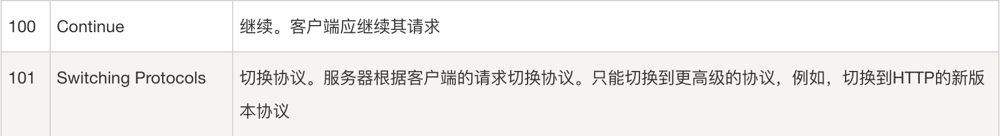
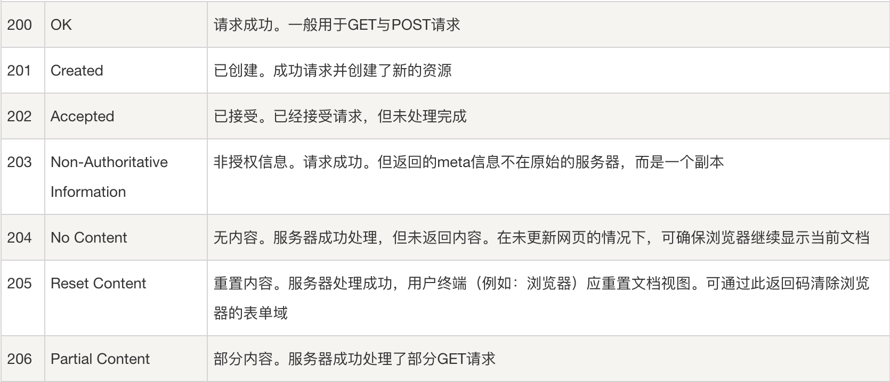
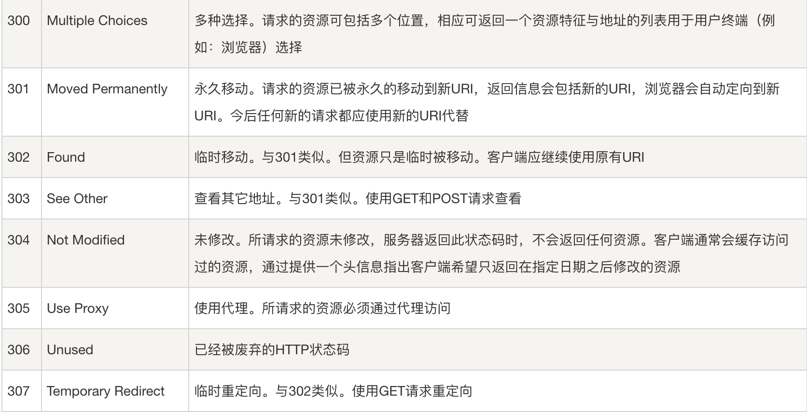
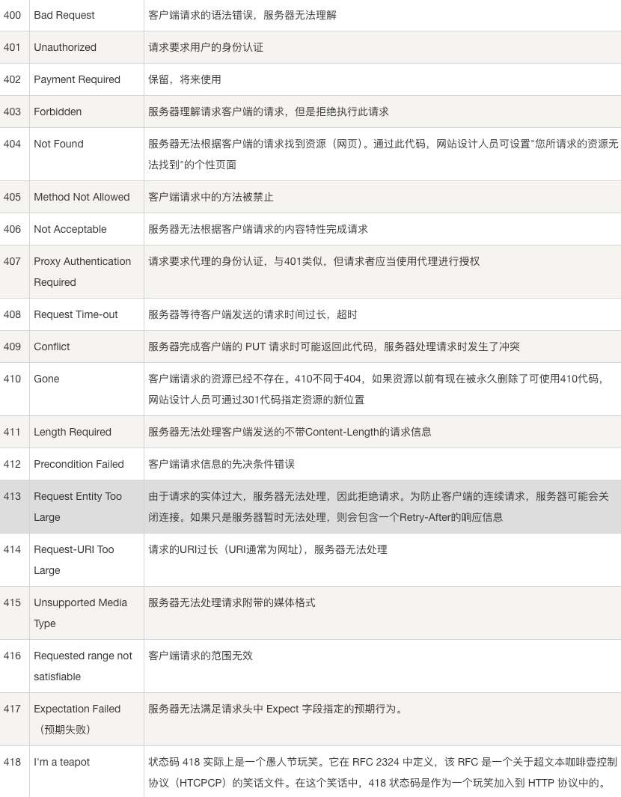
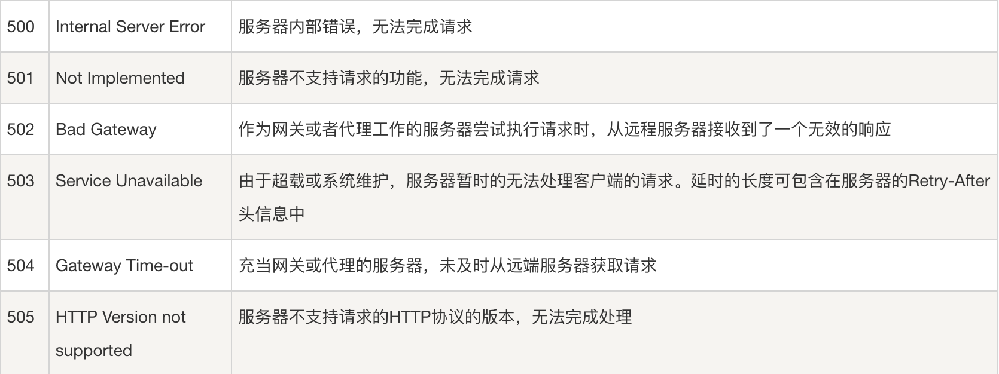

## HTTP 响应状态码

### HTTP 响应状态码用来表明特定 HTTP 请求是否成功完成。 响应被归为以下五大类：

#### 1.信息响应 (100-199)

#### 2.成功响应 (200-299)

#### 3.重定向消息 (300-399)

#### 4.客户端错误消息 (400-499)

#### 5.服务端错误消息 (500-599)

[详细错误码参考链接](https://developer.mozilla.org/zh-CN/docs/Web/HTTP/Reference/Status)
