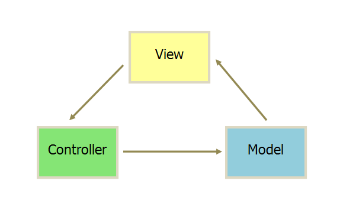
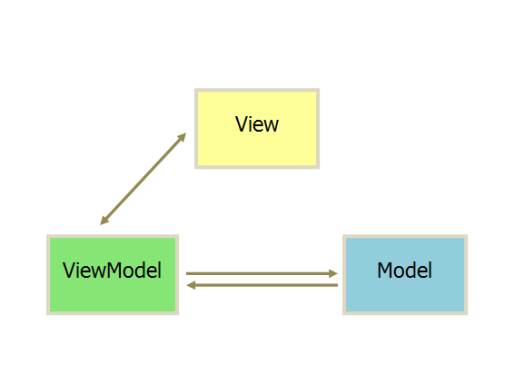

## MVVM 与 MVC 设计模式区别

### MVVM 与 MVC 模式

1.View 传送指令到 Controller

2.Controller 完成业务逻辑后改变 Model 状态

3.Model 将新的数据发送至 View,用户得到反馈

MVVM: View 的变化会自动更新到 ViewModel,ViewModel 的变化也会自动同步到 View 上显示,通过数据来显示视图层。

### MVVM 模式的优点以及与 MVC 模式的区别

MVVM 模式的优点:

1.低耦合: View 可以独立于 Model 变化和修改,一个 ViewModel 可以绑定到不同的 View 上,当 View 变化的时候 Model 可以不变,当 Model 变化的时候 View 也可以不变。

2.可重用性: 可以把一些视图逻辑放在一个 ViewModel 里面,让很多 View 重用这段视图逻辑。

3.独立开发: 开发人员可以专注于业务逻辑和数据的开发,设计人员可以专注于页面的设计。

MVVM 和 MVC 的区别:

1.MVC 中 Controller 演变成 MVVM 中的 ViewModel
2.MVVM 通过数据来显示视图层而不是节点操作
