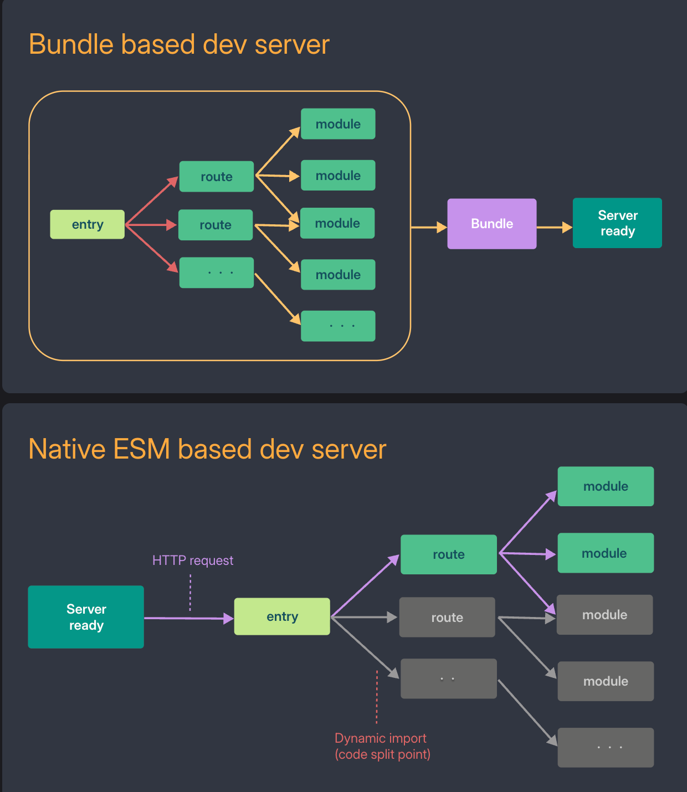

### vite 和 webpack 对比

```
对比维度	 Webpack	              Vite
架构思想	 先打包后启动	          按需加载，原生 ESM
开发体验	 启动慢、热更新慢	       极速启动、热更新快
配置复杂度	高	                 简单
构建性能	 一般	                 更快（esbuild + Rollup）
适配框架	 Vue2、React、Angular	 Vue3 官方推荐，支持 React
类型支持	 一般	                 优秀（内建 TS）
插件生态	 丰富但复杂	            稳定增长中
学习成本	 高	                   低
```

### vite 为什么比 webpack 快 ？

#### 1.浏览器本身就支持 ES Modules，webpack 需要将es6代码转换成es5代码，再在浏览器运行，vite不需要

#### 2.vite根据情景动态导入代码，即只在当前屏幕上实际使用时才会被处理。webpack需要将全部资源打包，然后再运行在浏览器上




### 拓展： vite 有啥不好？

#### webpack生态基础好，插件配置丰富，vite新型打包工具，生态不如webpack